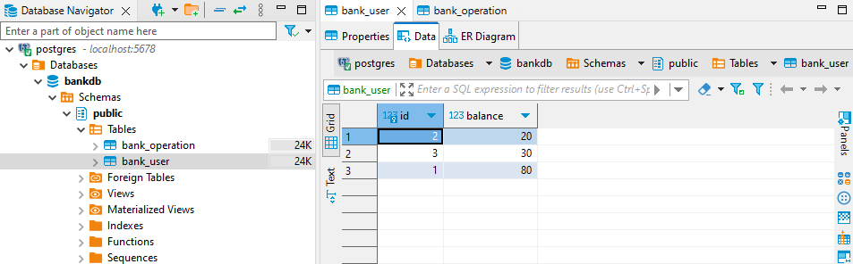
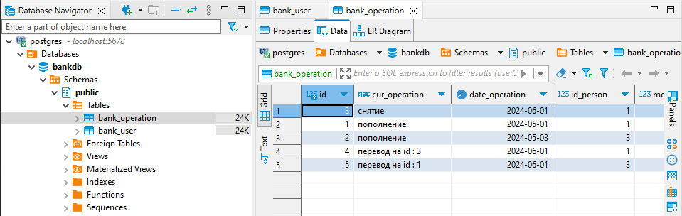

BankController - класс, который имеет методы для управления приложением;
BankService - класс, содержащий методы для работы приложения;
BankAppRunner - запускает приложение;

getBalance - запрашивает баланс
putMoney - положить деньги на баланс
takeMoney - взять деньги с баланса
transferMoney - перевод д/с между счетами
getOperationList - запрос списка совершенных операций

bank_user table:

bank_operation table:
