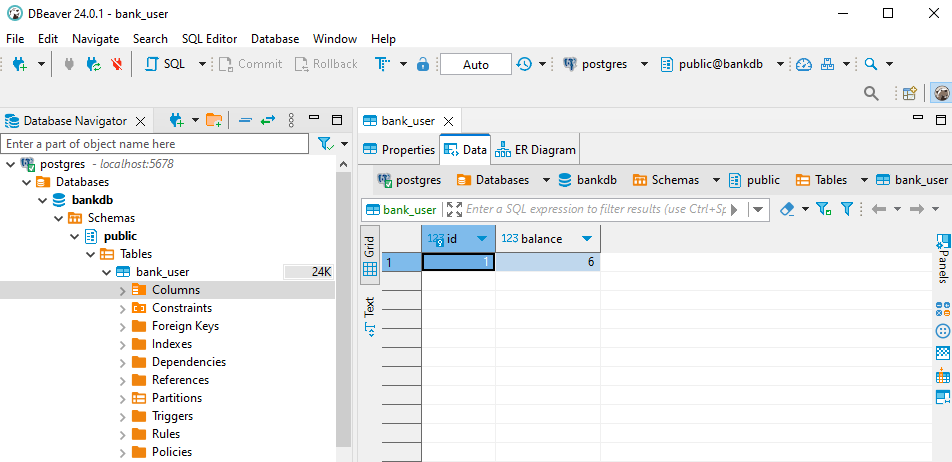

BankController - класс, который имеет методы для управления приложением;
BankService - класс, содержащий методы для работы приложения;
BankAppRunner - запускает приложение;
entity - сущности;
repository - репозитории;

